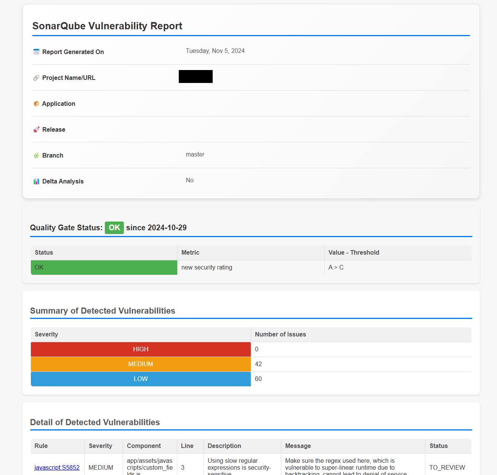

# SonarFlex



## Overview

**SonarFlex** generates detailed vulnerability reports from a SonarQube instance. With customizable options and support for different SonarQube versions, SonarFlex helps teams stay on top of security issues and code quality.

## Installation

- **Requirements**: Node.js v14+
  
To install globally, run:

```bash
npm install -g sonar-report
```

## Usage

SonarFlex can generate reports with various configurations. To view all available options, run:

```bash
sonar-report -h
```

This will display:

```plaintext
Usage: sonar-report [options]

Generate a vulnerability report from a SonarQube instance.
```

### Environment Variables

- **http_proxy**: Proxy to connect to SonarQube (`http://<host>:<port>`)
- **NODE_EXTRA_CA_CERTS**: Custom certificate authority file for SSL verification (PEM format)

### Example Command

Generate a report:

```bash
sonar-report \
  --sonarurl="https://sonarcloud.io" \
  --sonarcomponent="soprasteria_sonar-report" \
  --sonarorganization="sopra-steria" \
  --project="Sonar Report" \
  --application="sonar-report" \
  --release="1.0.0" \
  --branch="master" \
  --output="samples/sonar-report_sonar-report.html"
```

To open the report in your browser:

```bash
xdg-open samples/sonar-report_sonar-report.html
```

## Migrating to v3

### Key Changes

- **Flag Changes**: Most flags now use kebab-case.
- **Output Folder**: Use the `--output` flag to specify a folder for the generated report. This enables viewing summaries directly in CI pipelines.

Example summary format:

```plaintext
Report Generated On Wed Aug 24 2022

Project Name: Sonar Report
Application: sonar-report
Release: 1.0.0
Delta analysis: No

Summary of the Detected Vulnerabilities

Severity: HIGH
Number of Issues: 0

Severity: MEDIUM
Number of Issues: 0

Severity: LOW
Number of Issues: 0
```

## Key Parameters

### `--since-leak-period`

Enables delta analysis. If set to `true`, only vulnerabilities added since a specific date/version or within a set number of days are shown.

This option:

1. Retrieves `sonar.leak.period` from SonarQube settings.
2. Filters issues by this period.

More information on [SonarQube’s leak period](https://docs.sonarqube.org/latest/user-guide/fixing-the-water-leak/).

### `--allbugs`

- **"false"**: Only vulnerabilities are included.
- **"true"**: Includes all bugs.

### `--fix-missing-rule`

Handles discrepancies in issue types (`VULNERABILITY` vs `CODE_SMELL`) across different SonarQube versions.

Activating this parameter:

- Ensures rules are extracted even when types don’t align.
- May result in additional issues being included.

### `--no-security-hotspot`

Disables hotspot processing, which varies by SonarQube version. Use this option if your instance doesn’t fully support hotspots.

#### Hotspot Support by SonarQube Version:

- **< 7.3**: No support for hotspots.
- **7.3 - 7.8**: Hotspots stored in `/issues` endpoint; some statuses unavailable.
- **7.8 - 8.2**: Hotspots fully supported in `/issues`.
- **>= 8.2**: Hotspots moved to `/hotspots` endpoint.

To check your instance’s behavior:

- View `api/system/status` for version info.
- Check `/web_api/api/issues/search` and `/web_api/api/rules/search` for parameter options.

## Development

To set up for development, install dependencies:

```bash
npm install
```

Then, run commands like in the [Usage](#usage) section but replace `sonar-report` with `node cli.js`.

## Troubleshooting

### Common Issues

- **Missing Rule Descriptions**: Use `--fix-missing-rule` to fetch all rules.
- **400 Bad Request for Hotspot Types**: If your SonarQube instance doesn’t support hotspots, use `--no-security-hotspot`.
- **Too Many Results**: SonarQube limits results to 10,000. Use filters or remove `--allbugs` if needed.

## Additional Notes

Refer to SonarQube’s documentation and your instance’s API documentation for details on available settings:

- **Status**: `${sonarBaseURL}/api/system/status`
- **Issues**: `${sonarBaseURL}/web_api/api/issues/search`
- **Rules**: `${sonarBaseURL}/web_api/api/rules/search`
- **Hotspots**: `${sonarBaseURL}/web_api/api/hotspots`

## Application Improvements Summary:

1. **Enhanced Report Layout and Design**:
   - Redesigned the HTML report layout to improve readability and visual appeal.
   - Introduced a clean, professional look with improved font choices, spacing, and padding, making the report easier to scan.
   - Used subtle background shading, borders, and rounded corners for sections to make the report visually organized.

2. **Detailed Sectioned UI for Report Data**:
   - Structured the report into distinct sections, including the "Summary," "Quality Gate Status," and "Detailed Vulnerabilities" sections, so users can easily locate specific information.
   - Improved headings with blue underlines to visually separate sections and enhance navigation.

3. **Severity-Based Color Coding**:
   - Implemented color-coded badges for severity levels (HIGH, MEDIUM, LOW) in both the summary and details sections, helping users quickly identify critical issues.
   - Used color contrast to make each severity level easily distinguishable and visually prominent.

4. **Overflow and Responsive Table Improvements**:
   - Adjusted the layout for the "Detailed Vulnerabilities" table to handle overflow issues, ensuring data displays correctly even with long text entries.
   - Set maximum column widths for specific fields like "Component" and "Message" to prevent overflowing text, while still displaying important information with ellipsis (`...`) where necessary.
   - Enabled horizontal scrolling for the details section, allowing users to view full data on smaller screens or when the table content exceeds the container width.

5. **Download and Export Options**:
   - Added an "Export to PDF" feature using `html2pdf.js`, enabling users to save the report as a PDF file for sharing or archiving.
   - Moved the "Export to PDF" button to the top-right of the "Summary" section for quick access, following UI conventions for document actions.
   - Positioned the "Print Report" button in a clearly visible area to make it convenient for users to print a hard copy of the report.

6. **Interactive and Accessible Features**:
   - Added alt text for links and icon descriptions to improve accessibility for users with screen readers.
   - Improved link styling with color and hover effects, making clickable elements easily identifiable.
   - Used icons (e.g., 📅, 🔗, 📦) next to data labels for a more engaging and visually appealing experience in the summary section.

7. **Tooltips and Helper Text**:
   - Added tooltips or helper text where necessary, especially for complex fields and severity levels, to clarify information for users unfamiliar with specific terms or concepts.

8. **Consistent Iconography and Visual Indicators**:
   - Standardized the use of icons across the application to create a cohesive look and make key information immediately recognizable.
   - Used status badges for "Quality Gate Status" (e.g., green for OK, red for FAILED) to reinforce the report’s current state at a glance.

9. **Improved Error Handling and Feedback**:
   - Enhanced error messaging for PDF export or data loading issues, providing users with clearer feedback and troubleshooting suggestions if something goes wrong.
   - Checked compatibility with various SonarQube versions, ensuring error-free functionality for different configurations and environments.

10. **Code Refactoring and Modularity**:
    - Refactored CSS styling to make it modular and easier to maintain, especially for shared components like tables, buttons, and badges.
    - Improved JavaScript modularity by organizing functions, such as PDF export, into reusable code blocks, making future updates and maintenance simpler.
