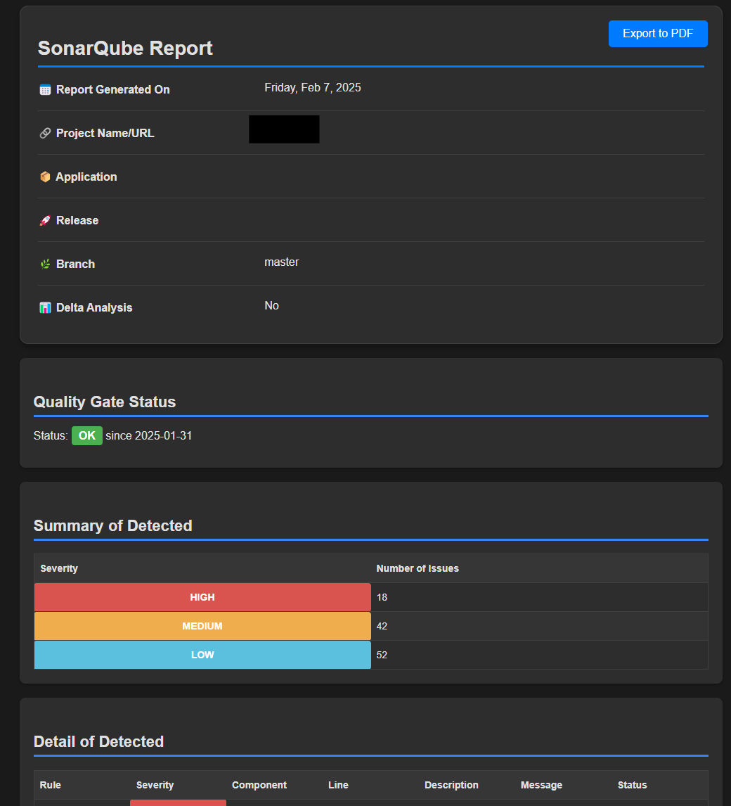

# 📊 SonarHawk

> Modern vulnerability reporting for SonarQube with enhanced features and dark mode support.


<p align="center">
  
</p>

## ✨ Highlights

- 🌙 Dark theme by default (light theme available)
- 📱 Responsive modern UI design
- 🔒 Full security hotspot support
- 📊 Enhanced quality gates reporting
- 📄 PDF export functionality
- 🔄 Delta analysis capabilities
- 🌐 Advanced proxy support
- 🐛 Debug mode for troubleshooting

## 🚀 Quick Start

### Prerequisites

- Node.js >= 14.x
- SonarQube instance (v7.9 - v10.x)
- SonarQube access token

### Installation

```bash
npm install -g sonarhawk
```

### Basic Usage

```bash
# Generate a report with default settings (dark theme)
sonarhawk \
  --sonarurl="https://sonar.company.com" \
  --sonarcomponent="project-key" \
  --sonartoken="your-token" \
  --output="report.html"

# Generate a report with light theme
sonarhawk \
  --sonarurl="https://sonar.company.com" \
  --sonarcomponent="project-key" \
  --sonartoken="your-token" \
  --output="report.html" \
  --light-theme
```

## 📖 Documentation

### Essential Configuration

```bash
# Authentication (Token - Recommended)
sonarhawk --sonartoken="your-token"

# Authentication (Username/Password)
sonarhawk --sonarusername="user" --sonarpassword="pass"

# Branch Analysis
sonarhawk --branch="feature/new-auth"

# Quality Gates
sonarhawk --quality-gate-status --coverage
```

### Report Customization

```bash
# Custom Template
sonarhawk --ejs-file="template.ejs"

# Custom Styling
sonarhawk --stylesheet-file="custom.css"

# Custom Labels
sonarhawk \
  --vulnerability-phrase="Security Issue" \
  --vulnerability-plural-phrase="Security Issues"
```

### Theme Options

Use the dark theme:

```bash
sonarhawk --sonarurl=http://your.sonar.instance --sonarcomponent=your:project:key --output=report.html --dark-theme
```

## 🔧 Configuration Options

### Required Options

| Option             | Description   | Default |
| ------------------ | ------------- | ------- |
| `--sonarurl`       | SonarQube URL | -       |
| `--sonarcomponent` | Project key   | -       |
| `--sonartoken`     | Auth token    | -       |
| `--output`         | Report path   | -       |

### Analysis Options

| Option                  | Description       | Default |
| ----------------------- | ----------------- | ------- |
| `--branch`              | Branch to analyze | main    |
| `--in-new-code-period`  | Delta analysis    | false   |
| `--allbugs`             | Include all bugs  | false   |
| `--no-security-hotspot` | Disable hotspots  | false   |

### Visualization Options

| Option                  | Description        | Default |
| ----------------------- | ------------------ | ------- |
| `--quality-gate-status` | Show quality gates | false   |
| `--coverage`            | Show coverage      | false   |
| `--link-issues`         | Link to SonarQube  | false   |
| `--no-rules-in-report`  | Hide rules section | false   |
| `--dark-theme`          | Enable dark theme  | false   |

## 🛠️ Advanced Features

### Delta Analysis

Track changes between versions:

```bash
sonarhawk \
  --in-new-code-period \
  --branch="feature/new-auth"
```

### Quality Gate Status

Include detailed quality metrics:

```bash
sonarhawk \
  --quality-gate-status \
  --coverage
```

### Custom Report Styling

```bash
sonarhawk \
  --stylesheet-file="custom.css" \
  --ejs-file="template.ejs"
```

## 🎨 Themes

### Dark Theme (Default)

The dark theme is enabled by default for better readability and reduced eye strain.

<details>
<summary>Dark Theme Features</summary>

- Dark background (#1a1a1a)
- Light text (#e0e0e0)
- Blue accent colors
- Enhanced contrast for code blocks
- Automatic light theme switching for printing

</details>

### Light Theme

Use `--light-theme` to enable the light theme.

<details>
<summary>Light Theme Features</summary>

- Light background (#f7f7f7)
- Dark text (#333333)
- Clean, minimal design
- Print-optimized colors
- High contrast for accessibility

</details>

## 📋 Examples

### Generate a Full Report

```bash
sonarhawk \
  --sonarurl="https://sonar.company.com" \
  --sonarcomponent="project-key" \
  --sonartoken="your-token" \
  --output="full-report.html" \
  --quality-gate-status \
  --coverage \
  --link-issues
```

### Delta Analysis Report

```bash
sonarhawk \
  --sonarurl="https://sonar.company.com" \
  --sonarcomponent="project-key" \
  --sonartoken="your-token" \
  --output="delta-report.html" \
  --in-new-code-period \
  --branch="feature/new-auth"
```

### Custom Styling

```bash
sonarhawk \
  --sonarurl="https://sonar.company.com" \
  --sonarcomponent="project-key" \
  --stylesheet-file="custom.css" \
  --ejs-file="custom-template.ejs"
```

## 🔧 Troubleshooting

### Common Issues

1. **Authentication Failed**

   ```bash
   # Verify your token
   sonarhawk --debug --sonartoken="your-token" ...
   ```

2. **Proxy Issues**

   ```bash
   # Use explicit proxy configuration
   sonarhawk --http-proxy="http://proxy.company.com:8080" ...
   ```

3. **Version Compatibility**
   ```bash
   # Check SonarQube version
   sonarhawk --debug ...
   ```

### Debug Mode

Enable verbose logging:

```bash
sonarhawk --debug --output="report.html" ...
```

## 📖 Additional Resources

- [Changelog](CHANGELOG.md)
- [SonarQube API Documentation](https://docs.sonarqube.org/latest/extend/web-api/)
- [Report Templates](docs/templates.md)
- [Contributing Guidelines](CONTRIBUTING.md)

## 🤝 Contributing

1. Fork the repository
2. Create feature branch (`git checkout -b feature/AmazingFeature`)
3. Commit changes (`git commit -m 'Add AmazingFeature'`)
4. Push to branch (`git push origin feature/AmazingFeature`)
5. Open Pull Request

## 📄 License

MIT License - see [LICENSE](LICENSE) for details

## 🙏 Acknowledgments

- Original [sonar-report](https://github.com/soprasteria/sonar-report) team
- [SonarQube](https://www.sonarqube.org/) team for their excellent API
- Community contributors and users

---

<p align="center">
  <sub>Built with ❤️ by the SonarHawk Team</sub><br>
  <sub>MIT License | Copyright © 2024</sub>
</p>
